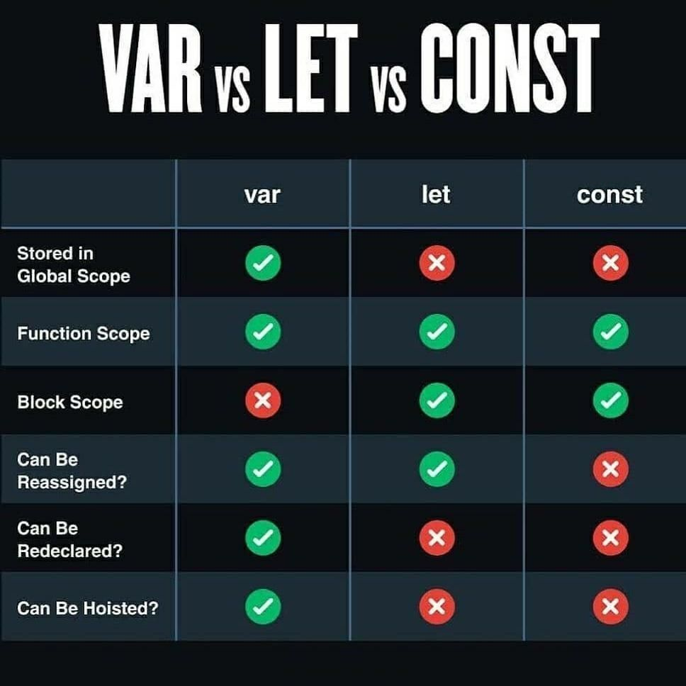

# JavaScript Functions

- [Challenges](#challenges)
- [Lecture Notes](#lecture-notes)

#### Overview
Functions are a fundamental building block in JavaScript and in programming in general. Functions are reusable pieces of code that only execute when invoked and always return an output. Functions can have information (arguments) passed into the scope of the function through placeholders called parameters. Functions are designed to be used many times in a program and should be as generic as possible while still being descriptive as to their purpose.

#### Previous Lecture (43 min)
[](https://www.youtube.com/watch?v=YyG1hetdqQI)

#### Learning Objectives
- can explain the purpose of a function
- can define the anatomy of an arrow function
- can create a function that is reusable and dynamic
- can distinguish between a function call and a function expression
- can utilize parameters within a function
- can demonstrate the use of pseudocode to guide logical steps

#### Vocabulary
- function
- encapsulation
- arrow syntax
- function expresson
- const
- function invocation / function call
- code block
- return
- parameter
- argument
- algorithm
- function signature
- pseudocoding

#### Additional Resources
- [W3Schools JavaScript Functions](https://www.w3schools.com/js/js_functions.asp)
- [Edabit Code Challenges](https://edabit.com/challenges/javascript)
- [How to Write Pseudocode](https://www.geeksforgeeks.org/how-to-write-a-pseudo-code/)
- [Many Ways to Create Functions](https://javascript.info/function-expressions)



#### Process
- `cd` into the `javascript-intro-challenges` repository
- Create a new branch: `functions-initials1-initials2` (ex. functions-aw-sp)
- `touch` a file with no spaces and `.js` extension: `functions-student1-student2.js` (ex. functions-austin-sarah.js)
- Open the folder in a text editor
- Code!

#### Troubleshooting Tips
- Does the function have a return?
- Is there a `console.log` on the function invocation?
- Does the number of arguments match the number of parameters?

---

### Functions: Little Code Machines
A **function** is a set of instructions detailing how to do a task. We can use the instructions to execute an action over and over again. Function logic should be contained so that the internal workings of the function should not interact with the rest of the program. This is the idea of **encapsulation**.

### Anatomy of a Function

```javascript
const greeting = () => {
  return "Hello there LEARN student!"
}
````

Functions consists of the following:
1. Variable declaration
    - Just like any other variable, we must inform JavaScript with a declaration
    - Because function expressions should only be assigned one time it is best practice to use the variable declaration that won't allow reassigning
    - `const`
2. Variable name
    - Variables must be camelCase and descriptive as to the intent of the function
    - `const greeting`
3. Single equal sign
    - Variables must be assigned with a single equal sign
    - `const greeting =`
4. Parentheses
    - Parentheses describes an action in JavaScript
    - Parentheses can take parameter to pass inputs to a function
    - `const greeting = ()`
5. Arrow
    - Function syntax
    - `const greeting = () =>`
6. Curly braces
    - Curly braces define a code block where the logic is encapsulated
    - `const greeting = () => {}`
7. Return
    - Describes the output of a function
    - Without a return, a function will log `undefined`
    - There can only be one executable return per code block
    ```
      const greeting = () => {
        return
      }
    ```

### Function Expression

```javascript
const greeting = () => {
  return "Hello there LEARN student!"
}
````

There are several ways to define a function in JavaScript. There is a keyword *function* that can be used to create what is called a named function declaration. In programming there are many tools for the job. It is up to us as developers to find the best tool for the problem we are facing. At LEARN, we will focus on creating function expressions using variable declarations and the **arrow syntax**. The arrow syntax provides a concise approach to describing a function action in JavaScript. The arrow syntax also has some advantages as we move into more complicated implementations of JavaScript.

A **function expressions** is a variable that holds the logic of a function. Our function expression will be declared using the variable declaration const. The variable declaration **const** will prohibit the function expression from accidentally being redeclared.

Great! We have a function. But this function is not doing anything yet. At this point, JavaScript recognizes that our function exists, but the power of a function is that it is a little machine that can be used over and over again. So how do we tell the program when and how often to run our little code machine?

### Function Invocation/Call

```javascript
const greeting = () => {
  return "Hello there LEARN student!"
}
console.log(greeting())
````

We have a function that is recognized by the program and now we need to tell our function when and how often to execute. Telling our function to run is called a **function invocation** or **function call**. Invocation and call are often used interchangeably. While we only have one function expression, we can have as many function invocations as needed for our program.

```javascript
const greeting = () => {
  return "Hello there LEARN student!"
}
console.log(greeting())
// output --> "Hello there LEARN student!"
console.log(greeting())
// output --> "Hello there LEARN student!"
console.log(greeting())
// output --> "Hello there LEARN student!"
````

To invoke or call our function we used the name that we gave our variable that holds the function expression. Following the variable name is a set of parentheses. Calling the function by its name will tell the program to execute the steps described in the function expression. In order to see the output of our function, we have wrapped our function call in a `console.log`.

### Function Logic
After the arrow `=>` in our function expression is where all the logic lives. It is a common practice to define a code block. A **code block** is a group of statements wrapped by curly braces. Inside the code block we can write any JavaScript code that is necessary to get to the desired output of the function. Within the logic there is going to be *one thing* that is the ultimate function output. That output is defined by the JavaScript keyword **return**. Every function code block needs exactly one return. If you omit the return your function will output `undefined`.

### Function Parameters and Arguments
It is important to remember when creating function logic that functions should always be encapsulated. This means the logic in your function cannot reference other information in your program. The problem with this is without any external information the function logic is limited. Functions often require external information in order to perform the appropriate task.   This problem is solved by function parameters and arguments.

In the previous example of the `greeter` function there was only one possible output. As many times as we invoked the function we only ever recieved a string containing the characters, "Hello there LEARN Student!" Let's enhance this function using a parameter and argument to introduce an input to the function.

```javascript
const greeting = (name) => {
  return `Hello there ${name}!`
}
console.log(greeting("Matt"))
// output --> "Hello there Matt!"
console.log(greeting("Rachael"))
// output --> "Hello there Rachael!"
```

Now our function output will be different each time it is invoked. In the example above, `name` is a parameter. A **parameter** is a placeholder variable that is defined inside the parentheses of the function expression. Once it is defined in the parentheses, it can be leveraged anywhere in the function logic.

The parameter is then assigned a value called an argument. An **argument** is the actual content passed to the function inside the parentheses of the function invocation. The argument value must be a data type recognized by JavaScript. The argument is represented in the function for every instance of the parameter. Now our function output changes based on the input while still maintaining encapsulation.

```javascript
console.log(greeting("Sam"))
// output --> "Hello there Sam!"
console.log(greeting("John"))
// output --> "Hello there John!"
```

### Multiple Parameters and Arguments
Functions are not limited to a single input. We can pass as many arguments into a function as we want. We just have to define an equal number of parameters.

```javascript
const multiplier = (num1, num2) => {
  return num1 * num2
}

console.log(multiplier(3, 5))
// output --> 15
console.log(multiplier(5, 8))
// output --> 40
```

It is common that the argument values will be represented by variables.

```javascript
var myNumber1 = 3
var myNumber2 = 5
var myNumber3 = 8

console.log(multiplier(myNumber1, myNumber2))
// output --> 15
console.log(multiplier(myNumber2, myNumber3))
// output --> 40
```
The variable should not be named the same thing as the function parameters.

### Pseudocode
When we are faced with creating a function that is going to take an input and perform logic to produce an output what we are doing is creating an **algorithm**. This is often a complex task that requires a lot of mental heavy-lifting. Anytime we are faced with a complex problem, it is a good idea to break it down.

A common workflow to break down a function algorithm is to start with an input and output. This will ensure we know what the function is going to do and what arguments it will require. The input and output of the function is called the **function signature**. Once we have established the signature, we can create a list of the logical steps to get from input to output. The list should be plain language using code terms but not coding itself. This process of establishing the function signature and creating an actionable plan in human readable words is called **pseudocoding**. Writing pseudocode is a really good habit as it gives us a plan and translates between code communication and human communication.

Let's work through an algorithm prompt using pseudocode.

Prompt: Write a function called `tallEnough` that takes an argument of a person's height in inches and returns whether or not the person meets the 40 inch height requirement to ride the rollercoaster.

```javascript
// Function Signature
// input: number
// output: string indicating allowed, denied, or error

// Examples
// input: 39 // output --> "Cannot ride the rollercoaster"
// input: 45 // output --> "Buckle up, let's ride"
// input: "yolo" // output --> "error"

// Process
// create a function called tallEnough that takes in a number called height
// if height is less than 40 return "Cannot ride the rollercoaster"
// if height is greater than or equal to 40 return "Buckle up, let's ride"
// any other input return error
```

Now let's build the actual code around the pseudocode.

```javascript
// create a function called tallEnough that takes in a number called height
const tallEnough = (height) => {
  // if height is less than 40 return "Cannot ride the rollercoaster"
  if(height < 40) {
    return "Cannot ride the rollercoaster"
  }
  // if height is greater than or equal to 40 return "Buckle up, let's ride"
  else if(height >= 40) {
    return "Buckle up, let's ride"
  }
  // any other input return error
  else {
    return "error"
  }
}
```

We can now use our example inputs from the pseudocode to test the output of the function.

```javascript
// Examples
// input: 39 // output --> "Cannot ride the rollercoaster"
// input: 45 // output --> "Buckle up, let's ride"
// input: "yolo" // output --> "error"

console.log(tallEnough(39))
// output --> "Cannot ride the rollercoaster"

console.log(tallEnough(45))
// output --> "Buckle up, let's ride"

console.log(tallEnough("yolo"))
// output --> "error"
```
---

### Challenges

```javascript
// Copy the challenges into your JavaScript file. Comment out the instructions and code the solution to each problem beneath the prompt. Each solution requires pseudocode. Test your functions with multiple function calls.

// 1. Write a function named `marco` that returns "polo".    
    // create a function named marco
    const marco = () => {
      // calling the function will return polo
      return "polo"
    }
    console.log(marco())
    // Output: "polo"

// 2. Write a function named `greeting` that takes a name as an argument and returns "Welcome, <person's name here>!"
    // create a function named greeting
    const greeting = (name) => {
      // calling the function will return a string interpolation with the given name
      return `Welcome, ${name}!`
    }
    console.log(greeting("Juan"))
    // Output: "Welcome, Juan!"
    console.log(greeting("Janice"))
    // Output: "Welcome, Janice!"

// 3. Write a function named `oddOrEven` that takes a number as an argument and returns whether the number is odd or even.
    // create a function named oddOrEven that takes a number as an argument
    const oddOrEven = (number) => {
    // if the whole number remainder is equal to 0 return even using conditional, modulo, and strict equality operators
      if(number % 2 === 0) {
        return "even"
      }
    // if the whole number remainder is not equal to 0 return odd
      else {
        return "odd"
      }
    }
    console.log(oddOrEven(2022))
    // Output: "even"
    console.log(oddOrEven(2021))
    // Output: "odd"

// 4. Write a function named `triple` that takes a number as an argument and returns the result of that number multiplied by 3.
    // create a function named triple that takes a number as an argument
    const triple = (num) => {
        // return the result of that number multiplied by 3
        return num * 3
    }  
    console.log(triple(3))
    // Output: 9
    console.log(triple(4))
    // Output: 12

// 5. Write a function named `multiply` that takes two numbers as arguments and returns the result of the numbers multiplied together.
    // create a function named multiply that takes two numbers as arguments
    const multiply = (num1, num2) => {
      // returns the result of the numbers multiplied together
      return num1 * num2
    }
    console.log(multiply(3.5, 4))
    // Output: 14
    console.log(multiply(5, 60))
    // Output: 300

// 6. Write a function named `divisibleBy` that takes two numbers as arguments and returns whether the first number is evenly divisible by the second so that divisibleBy(10, 5) logs "10 is evenly divisible by 5".
    // create a function named divisibleBy that takes two numbers as arguments
    const divisibleBy = (num1, num2) => {
      // use operators (conditional, modulo, strict equality) to determine if the first number is evenly divisible by the second
      //if the whole number remainder is equal to 0 return using string interpolation that first number is evenly divisible by second number
      if(num1 % num2 === 0) {
        return `${num1} is evenly divisible by ${num2}`
      }
      // if the whole number remainder is not equal to 0 (determined using a strict inequality operator) return that first number is not evenly divisible by second number
      else if(num1 % num2 !== 0) {
        return `${num1} is not evenly divisible by ${num2}`
      }
    }
    console.log(divisibleBy(16, 4))
    // Output: "16 is evenly divisible by 4"
    console.log(divisibleBy(16, 3))
    // Output: "16 is not evenly divisible by 3"

// 7. Write a function named `assignGrade` that takes a number score as an argument and returns the letter grade for the score.
    // create a function named assignGrade that takes a number score as an argument
    const assignGrade = (score) => {
      // use operators (conditional, modulo, relational) to determine the grade range for the given score
      // if the score is greater than or equal to 90 return A
      if(score >= 90) {
        return "A"
      }
      // if the score is greater than or equal to 80 but less than 90 return B
      else if(score >= 80) {
        return "B"
      }
      // if the score is greater than or equal to 70 but less than 80 return C
      else if(score >= 70) {
        return "C"
      }
      // if the score is greater than or equal to 60 but less than 70 return D
      else if(score >= 60) {
        return "D"
      }
      // if any other score return F
      else {
        return "F"
      }
    }
    console.log(assignGrade(13))
    // Output: "F"
    console.log(assignGrade(93))
    // Output: "A"
    console.log(assignGrade(83))
    // Output: "B"

// 8. Write a function named `isLonger` that takes two strings as arguments and returns the string that contains the most characters.
    // create a function named `isLonger` that takes two strings as arguments
    const isLonger = (string1, string2) => {
      // use operators (relational, conditional) and length property of each string to determine which string has the most characters
      // if the length of the first string is greater than the length of the second string return the first string
      if(string1.length > string2.length) {
        return string1
      }
      // if not return the second string
      else {
        return string2
      }
    }
    console.log(isLonger("coder", "full stack web developer"))
    // Output: "full stack web developer"
    console.log(isLonger("student", "intern"))
    // Output: "student"

// 9. Write a function named `greaterNum` that takes two numbers as arguments and returns whichever number is the greater (higher) number.
    // create a function named `greaterNum` that takes two numbers as arguments
    const greaterNum = (num1, num2) => {
      // use operators (relational, conditional) to determine which number is the higher number
      // if the first number is greater than the second number return the first number
      if(num1 > num2) {
        return num1
      }
      // if the second number is greater than the first number return the second number
      else if(num2 > num1) {
        return num2
      }
    }
    console.log(greaterNum(-44, 44))
    // Output: 44
    console.log(greaterNum(0, -23))
    // Output: 0

// 10. Write a function named `yelling` that takes a string as an argument and return the string in all uppercase case letters.
    // create a function named `yelling` that takes a string as an argument
    const yelling = (string) => {
      // use built-in uppercase method for strings to return string in all uppercase case letters
      return string.toUpperCase()
    }
    console.log(yelling("celebrate"))
    // Output: "CELEBRATE"
    console.log(yelling("change"))
    // Output: "CHANGE"
```    


### STRETCH Challenges

```javascript
// 1. The World Translator   
  // (a) Write a function named `helloWorld` that takes a language code (e.g. "es", "de", "en") as an argument and returns "Hello World!" in the given language. Ensure your function works for at least 5 languages.  
      // create a function named `helloWorld` that takes a language code as an argument
      const helloWorld = (lang) => {
        // use conditional and strict equality operators to select a foreign language
        // if language code is "fr" return Hello World! in French
        if(lang === "fr") {
          return "Bonjour le monde!"
        }
        // if language code is "ro" return Hello World! in Romanian
        else if(lang === "ro") {
          return "Salut Lume!"
        }
        // if language code is "uk" return Hello World! in Ukrainian
        else if(lang === "uk") {
          return "Привіт Світ!"
        }
        // if language code is "it" return Hello World! in Italian
        else if(lang === "it") {
          return "Ciao mondo!"
        }
        // if language code is "tr" return Hello World! in Turkish
        else if(lang === "tr") {
          return "Selam Dünya!"
        }
        // if language code is "en" return Hello World! in English
        else if(lang === "en") {
          return "Hello World!"
        }
        // all other language codes will return error code
        else {
          return "Try a different language"
        }
      }
      console.log(helloWorld("tr"))
      // Output: "Selam Dünya!"
      console.log(helloWorld("es"))
      // Output: "Try a different language"
      console.log(helloWorld("en"))
      // Output: "Hello World!"

  // (b) Have your function [default](https://developer.mozilla.org/en-US/docs/Web/JavaScript/Reference/Functions/Default_parameters) to returning English.
      // create a function named helloWorld2 that takes a language code and defaults to English
      const helloWorld2 = (lang = "en") => {
        // use conditional and strict equality operators to select a foreign language
        // if language code is "fr" return Hello World! in French
        if(lang === "fr") {
          return "Bonjour le monde!"
        }
        // if language code is "ro" return Hello World! in Romanian
        else if(lang === "ro") {
          return "Salut Lume!"
        }
        // if language code is "uk" return Hello World! in Ukrainian
        else if(lang === "uk") {
          return "Привіт Світ!"
        }
        // if language code is "it" return Hello World! in Italian
        else if(lang === "it") {
          return "Ciao mondo!"
        }
        // if language code is "tr" return Hello World! in Turkish
        else if(lang === "tr") {
          return "Selam Dünya!"
        }
        // if language code is "en" return Hello World! in English
        else if(lang === "en") {
          return "Hello World!"
        }
        // if any other language codes are used or no input return the default "Hello World!" in English
        else {
          return "Hello World!"
        }
      }
      console.log(helloWorld2("fr"))
      // Output: "Bonjour le monde!"
      console.log(helloWorld2("ro"))
      // Output: "Salut Lume!"
      console.log(helloWorld2("yi"))
      // Output: "Hello World!"
      console.log(helloWorld2())
      // Output: "Hello World!"

// 2. The Pluralizer  
  // (a) Write a function named `pluralizer` that takes a number and a singular noun as arguments and returns the number and pluralized form of the noun, if necessary.

  // pluralizer(5, "cat")
  // // expected output: "5 cats"

  // pluralizer(1, "dog")
  // // expected output: "1 dog"

    // create a function named `pluralizer` that takes a number and a singular noun as arguments
    const pluralizer = (number, noun) => {
      // use conditional and strict inequality operators to evaluate a number
      // if a number is not 1 return the number and the plural noun by attaching "s" using string interpolation
      if(number !== 1) {
        return `${number} ${noun}s`
      }
      // else return number and singular noun
      else {
        return `${number} ${noun}`
      }
    }
    console.log(pluralizer(15, "rose"))
    // Output: "15 roses"
    console.log(pluralizer(1, "tulip"))
    // Output: "1 tulip"
    console.log(pluralizer(0, "dandelion"))
    // Output: "0 dandelions"

  // (b) Enhance your function so it can handle a few collective nouns like "sheep", "goose", "child", "person" and "species".
    // create a function named `pluralizer2` that takes a number and a singular noun as arguments
    const pluralizer2 = (number, noun) => {
      // use conditional, strict equality, and strict inequality operators to evaluate number and noun
      // if the noun is sheep, deer, species, or moose return the number and the singular noun
      if(noun === "sheep" || noun === "deer" || noun === "species" || noun === "moose") {
        return `${number} ${noun}`
      }
      // if a number is not 1 and the noun is child return the number and children using string interpolation
      else if(number !== 1 && noun === "child") {
        return `${number} children`
      }
      // if a number is not 1 and the noun is goose return the number and geese
      else if(number !== 1 && noun === "goose") {
        return `${number} geese`
      }
      // if a number is not 1 and the noun is person return the number and people
      else if(number !== 1 && noun === "person") {
        return `${number} people`
      }
      // if a number is not 1 return the number and the plural noun by attaching s
      else if(number !== 1) {
        return `${number} ${noun}s`
      }
      // else return number and singular noun
      else {
        return `${number} ${noun}`
      }
    }
    console.log(pluralizer2(0, "child"))
    // Output: "0 children"
    console.log(pluralizer2(1, "child"))
    // Output: "1 child"
    console.log(pluralizer2(2, "deer"))
    // Output: "2 deer"
    console.log(pluralizer2(5, "goose"))
    // Output: "5 geese"
    console.log(pluralizer2(10, "play"))
    // Output: "10 plays"
```    

---

# Lecture Notes
### Overview
- Conditional statements create logic through evaluations
- Only one outcome

### Goals
### Major Takeaways
### Lecture
### Review


// Functions are awesome. We love functions. They make our programs smart. Functions are little machines. They are snippets of functionality that run on command. This is a very powerful concept beacuse it takes what we have been doing with if/else statements and allows us to have control over those actions. The control we get is twofold: first, is we can decide WHEN that action happens. Right now your code will run top to bottom and when you get to your if/else statement, that block will run and when we get to the for loop, that block will run. Functions only execute when we as developers tell them to. The second measure of control we have is that our functions are reusable. Meaning we can use the same code machine over and over again.

// The reason functions are reusable is because they are designed to be relatively neutral. They need to take an input and produce an output.

// The concept of creating a little code machine that is only in charge of itself and shouldn't rely on any data other than the input is the concept of encapsulation. Encapsulation is a very important concept in development. As a developer, you want the output of your code, the decision that your code is making to rely ONLY on the input. ONLY if that is the case can you be certain that you will get predictable behavior.

// Okay, so functions. Like much else in code there are lots of ways to create functions in JavaScript. And as much as I hate saying this, the way that is most correct will depend on what you your goal is. It is one of those annoying answers that doesn't give you anymore information than you had before. But you will hear it a lot.

// So, there isn't a wrong way, but we are going to write functions in a way that is the most useful for the stack that we are working in. The best tool for our particular job.

// So with that, let's kick this off with a section called anatomy of a function.

// Our functions are going to start looking a lot like a variable meaning we need a declaration. Since functions should not be reassigned, we can use the declaration `const`.

const

// Next our function needs a name. We can name it whatever we want, as long as it follows two rules - 1) it is written in camelCase and 2) it communicates intent.

// I am going to create a function that is used for making coffee.

const makeCoffee =

// Functions are machines, they are used for actions. So following the equal sign we need a set of parentheses.

const makeCoffee = ()

// From here we need to indicate that what we are writing is a function. and we do that with an arrow. Which looks like this:

const makeCoffee = () =>

// In this particular syntax the arrow takes the place of the keyword function. It is the symbol representing a function action.

// After our voluptuous arrow, we are going to open a set of curly braces to indicate the exectuable action. Curly braces indicate action.

const makeCoffee = () => {
}

// And inside the curly braces we write our code. As a first step we are going to write the simplest code we can. Which will just be a statement of "coffee is made".

// But there is one more thing we need to talk about. It is a key word that must be paired with our full-figured arrow. For every fat arrow we need a return.

const makeCoffee = () => {
 return
}

// And that is going back to the idea that the job of a function is to act as a little code machine that gives an output. Return is a keyword that indicates what the output of the function is. Everytime you have a fat arrow, you need a return in regular JavaScript.

const makeCoffee = () => {
 return "Enjoy your coffee"
}

// Here is our function. It is beautiful. So let's run the code and see what happens... nothing.

// Well, technically not nothing. If we could look into our terminal we would see that JavaScript said, "oh you have a function called makeCoffee, that is nice." And that is all that that would happen.

// Functions are little machines. Little machines that don't run until they are told to run.

// So let's get some coffee made. To invoke the function, we reference the function by name and follow it with parentheses.

const makeCoffee = () => {
 return "Enjoy your coffee"
}
makeCoffee()

// We still need a console.log in order to see the outcome of our file in the terminal, but now if we are behind the sceen JavaScript says, "oh you have a function called makeCoffee, that is nice, oh now you want me to run that function, okay! Here you go."

// So to see the outcome of that function, we can wrap it in a console.log

const makeCoffee = () => {
 return "Enjoy your coffee"
}
console.log(makeCoffee())

// Boom! Now we are in business. We have output.

// And the cool thing we can do now is say we want 5 coffees. We don't have to write 5 functions. We only have to reuse the function we already have.

console.log(makeCoffee())
console.log(makeCoffee())
console.log(makeCoffee())

// So to recap, we have a reusable piece of code that does not run until it is invoked. And we can invoke (or call) the function as many times as is useful.

// Alright so let's add on. We are creating a function that produces an output, but it isn't too exciting. The reason functions are useful is because they are designed to be relatively neutral. They can take an input and produce an output.

// So if we want to add a little more action to the function we need to add an argument. An argument is a placeholder value, a little bit like a variable. It exists only in the context of the function.

const makeCoffee = (coffeeType) => {
 return `Enjoy your ${coffeeType}.`
}
console.log(makeCoffee())

// Now our little machine is set up to expect an input. You'll notice that the function runs but the value of coffeeType is undefined. If you remeber back to primitive data types, what is undefined? It is variable that has been declared, but not given a value. By puting coffeeType in the argument of our function, we declaring a variable that exists just in the context of this function.

// So if we declare a variable, we need to give it a value. So let's give it one.

// Just like in any other variable, this variable has to be a data type that JavaScript recognizes. But, unlike other variable we don't use the equal sign, we pass the value into the function invocation.

const makeCoffee = (coffeeType) => {
 return `Enjoy your ${coffeeType}.`
}
console.log(makeCoffee("Kona"))

// So the variable is just a placeholder for whatever we pass in. And we can pass in different values for every function invocation or call.

console.log(makeCoffee("Cappuccino"))
console.log(makeCoffee("Latte"))
console.log(makeCoffee("Espresso"))

// Now our function is reusable and significantly more interesting.

// Next we are going to look at a function that has more functionality inside. But to do that, we need to introduce a concept called pseudo coding.

// Pseudo coding is the process of writing out the process of your coding challenge in plain english. It is basically the same process as talking to a rubber duck. It forces you to think about the problem in advance rather than just jumping in and coding with no direction.

// Let's expand on our coffee function and have our program determine the price based on the size of your coffee.

// So first, let's pseudo code.
// Create a function that takes in two arguments: coffeeType and size
// if the size is large, return the coffeeType is $5
// if the size is medium, return the coffeeType is $4
// if the size is small, return the coffeeType is $3
// if non of the above, return an error message


const makeCoffee = (coffeeType, size) => {
 if(size === "large"){
   return `Your ${size} ${coffeeType} is $5`
 } else if(size === "medium"){
   return `Your ${size} ${coffeeType} is $4`
 } else if(size === "small"){
   return `Your ${size} ${coffeeType} is $3`
 } else {
   return "Something went wrong."
 }
}
console.log(makeCoffee("latte", "large"))
console.log(makeCoffee("black coffee", "medium"))
console.log(makeCoffee("cappuccino", "small"))
console.log(makeCoffee("latte"))

// Remember that every fat arrow needs a corresponding return. But there are three returns here. But, the thing about if/else statements is that no matter how many options we have, only one is ever going to run. So only one return is ever going to be hit by the program.

// I know you are all excited to code, you have been champing at the bit to get into the coding. But there is a lot more to being a developer than coding. And we are focused on a learning process. So I really encourage you to take your time, make sure you are understanding the concepts, that you are using git correctly, that you are following the naming conventions, that you are thinking about the process of coding. The biggest favor you can do for yourself is learn how to learn.


// Setting default values in the argument

const makeCoffee = (coffeeType, size="small") => {
 if(size === "large"){
   return `Your ${size} ${coffeeType} is $5`
 } else if(size === "medium"){
   return `Your ${size} ${coffeeType} is $4`
 } else if(size === "small"){
   return `Your ${size} ${coffeeType} is $3`
 } else {
   return "Something went wrong."
 }
}
console.log(makeCoffee("latte"))

---

# Lecture Notes

### Overview
-

### Process
- Ensure you are in the cohort-lecture-examples repo
- Ensure your local is up to date and there are no stale branches
- Create a new branch
- Create a JavaScript file with the naming convention `language-topic.js`
- Run the file with `node`

### Additional Notes and Goals
### Major Takeaways
### Lecture
#### Topic
### Review

### Next Steps
- Open the syllabus section and briefly run through the challenges and expectations
- Remind the student to use the `javascript-intro-challenges` repo
- Remind the students of the appropriate naming conventions for their branch and file
- Post pairs in Slack
- Open breakout rooms with ability for participants to choose their room

---
[Back to Syllabus](../README.md#unit-one-javascript-foundations)
