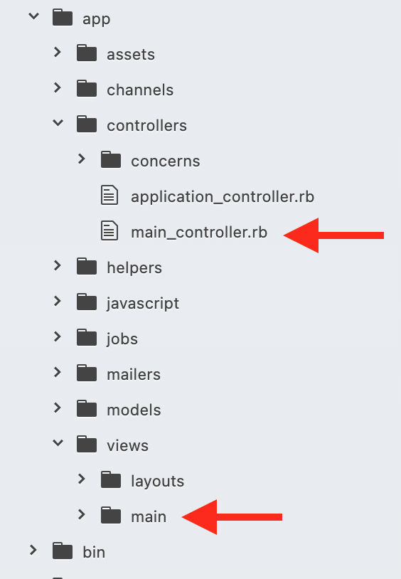

# Rails Controllers, Routes, and Views

#### Overview
Rails uses the MVC architectural pattern. MVC defines how an application handles different kinds of information. MVC separates an application into models for handling data and business logic, controllers to handle requests and retrieve the data from the model, and views for handling graphical user interface objects and presentation. This section will take a deep dive into the controller and view aspects of MVC.

#### Previous Lecture (1hr 7min)
[](https://www.youtube.com/watch?v=dprfcJq2xX4)

#### Learning Objectives
- can conceptualize the flow of data from route to controller to view
- can define ERB
- can use correct Ruby syntax to create navigation
- can describe the purpose of an instance variable
- can describe the anatomy of a route

#### Vocabulary
- controller
- view
- routes
- erb
- root
- Link_to

#### Process
- Create a new Rails app in the appropriate folder: $ `rails new routes_controllers_views -d postgresql -T`
- $ `cd routes_controllers_views`
- Create a database: $ `rails db:create`
- Begin the rails server: `$ rails server`
- In a browser navigate to: `http://localhost:3000`

#### Troubleshooting Tips
- Did you create your database?
- Are your view files in the correct folder?
- Errors? Always look at the first error in the list.

### Rails Response

To understand how to program a response, we need to have an idea of how a request is made to the Rails server. A typical request starts when a url is typed into the browser address bar and the user hits enter.

### The Controller

What the heck is a controller?? The Rails controller is the logical center of your application. It coordinates the interaction between the user, the views, and the model.

The controller:
- is responsible for routing external requests to internal actions. It handles people-friendly URLs extremely well
- manages caching
- manages helper modules, which extend the capabilities of the view templates without bulking up their code
- manages sessions, giving users the impression of an ongoing interaction with our applications

Let's see the controller in action!

From the command line, we can add a new Rails controller with a rails command:
```
$ rails generate controller Main
```

Rails creates all the files associated with this particular controller.
Output in terminal:
```
 create  app/controllers/main_controller.rb
      invoke  erb
      create    app/views/main
      invoke  helper
      create    app/helpers/main_helper.rb
      invoke  assets
      invoke    scss
      create      app/assets/stylesheets/main.scss
```

From this generate command we are going to use the controller file and the view folder.




Now we can add methods to the controller file that was created in the generate command.

Inside the controller, we define what we want to happen when a method is reached. In this case, when the `answer` method is triggered, it will render some html that reads "This is the answer".

**app/controllers/main_controller.rb**:
```ruby
class MainController < ApplicationController
  def answer
    render html: 'This is the answer'
  end
end
```

We access the method in the controller through our url request. This is done by appending a slash `/` and the name of your method to localhost:3000. Try navigating to `localhost:3000/answer`. At this point, we will see an error that says no route matches "/answer"

### The Route

In order for our Rails server to respond to a request to this url, it needs a particular path and an http verb. A `routes.rb` file in the `config` folder is created when you run `rails new`. This file is intended to house all valid urls in your application.


**config/routes.rb**


The route here is essentially adding an address to the application. Now when we navigate to `localhost:3000/answer`, Rails will determine that we have requested the `/answer` route. The route will find the `main` controller and call the `answer` method.

This completes the Rails response to the `/answer` request. When we visit `localhost:3000/answer` we should see a white page with the text "This is the answer".

### Add Another Route
Let's program another response. Let's say we want our Rails program to be able to respond to requests for:

`localhost:3000/question`

First, we can tell Rails to accept requests to `/question` in the `routes.rb`:

**config/routes.rb**:
```ruby
Rails.application.routes.draw do
  get '/answer' => 'main#answer'
  get '/question' => 'main#question'
```

Now, we need to add a `question` method to the `main` controller that will define how the application will respond.

**app/controllers/main_controller.rb**:
```ruby
class MainController < ApplicationController
  def answer
    render html: 'This is the answer'
  end

  def question
    render html: 'This is the question.'
  end
end
```

Now, our Rails app has all the information to display a response to the `/question` request. When we visit `localhost:3000/question`, we should see a white page with the text "This is the question".

### Landing Page

A landing page is what the user sees when they first visit your site. By default, Rails gives us a landing page at `localhost:3000` with the Rails boilerplate code. We can instruct our application to use another view as the landing page by using a helper method called **root**. The root route at the top because it is the most popular route and should be matched first. The root route can only have a `GET` action.

```ruby
Rails.application.routes.draw do
  root 'main#question'
  get '/answer' => 'main#answer'
  get '/question' => 'main#question'
end
```

### The View

So far our routes and controllers are only returning a basic string from the controller method. This is a great start, but now we want to make more complex views.

The generate command we ran earlier creates a directory in the `app/views` named after our controller. Inside this folder create a NEW FILE called `question.html.erb`
- `question` references the name of the method in the controller
- **erb** extension stands for `embedded Ruby`. Embedded Ruby or Templated Ruby is a file structure that allows us to code in HTML and drop Ruby code into the view file.

Let's add some text to the new file:

**views/main/question.html.erb**:
```
<p>Hello?</p>
```

Now, when we navigate to `localhost:3000/question`, we should see simple text saying "Hello?"

Going back to our controller, we can create an instance variable (since we are inside the class MainController), that we will render in our view:

**app/controllers/main_controller.rb**:
```ruby
class MainController < ApplicationController
  def answer
    render html: 'This is the answer'
  end

  def question
    @our_question = 'Why did the chicken cross the road?'
    render 'question.html.erb'
  end
end
```

Back in our view, we will refer back to the instance variable we set within the `question` method in the controller.

**views/main/question.html.erb**:

```
My joke: <%= @our_question %>!
```

The symbols `<%= %>` allow us to escape the HTML and embed Ruby syntax and logic. By wrapping our Ruby code in those symbols, it will execute on the page and then print the outcome.

#### Navigating Between Views

So far we have created controllers that manages our routes and views through directly manipulating the url. To make this process more dynamic we can add code to our view so the user can click a link to move between pages.

**views/main/home.html.erb**:
```
<h3>Wanna hear a joke?</h3>
<%= link_to 'Tell Me!', '/question' %>
```
**link_to** is a helper method that lives inside embedded Ruby tags and creates navigation in our Rails app. It takes two values: the first is the hyperlink and second is the route that will be added to the end of `localhost:3000`.

Earlier in our code we created our own landing page so our user won't see the Rails boilerplate code. To create a link that will navigate back to the landing page we pass a `'/'` as the route.

**views/main/question.html.erb**:
```
<h3>Back to Landing Page</h3>
<%= link_to 'Home', '/' %>
```

### Review

- The `routes.rb` file defines all the urls your application is prepared to respond to (it's like the address book of your Rails app)
- Each route will point to a method on a controller file
- The controller method will ultimately do the work you require and send the appropriate view response

## Challenges Routes, Views, Controllers

### As a user, I can visit a custom landing page at localhost:3000.

#### Create rails app
- $ rails new our_favorites -d postgresql -T
- $ cd our_favorites
- $ rails db:create
- $ rails s
- $ code .

#### Create controller
- $ rails g controller Main

```ruby
# Route
root 'main#home'

# View - in app/views/main, create an erb file - home.html.erb and add html
<h1>This is the landing page</h1>
<p>Brought to you by the home.html.erb who did not need a method<p>
```


### As a user, I can see the names of my team members as hyperlinks on the landing page.
```ruby
# home.html.erb (view)
<%= link_to 'Austin', '/austin'%>
<%= link_to 'Charlean', '/charlean'%>
```


### As a user, I can click on each team member's name and be taken to a page that displays a list of that team member's top three things. (Could be top three restaurants, activities, books, video games, hiking locations, beaches, doughnut shoppes, movies, etc.)
```ruby
# method in controller for each team member
def austin
end
def charlean
end

# routes for each team member
  get '/austin' => 'main#austin'
  get '/charlean' => 'main#charlean'

# app/views/main (view) create an erb file for each team member and add html/link to home
# austin
<h1>The best of the best in Austinville</h1>
<li>Nicole</li>
<li>Sheldon</li>
<li>Tacos</li>
<p>Brought to you by the austin.html.erb<p>
<%= link_to 'Home', '/'%>

# charlean
<h1>Guaranteed Laughter in the Jurisdiction of Charlean</h1>
<li>Olivia</li>
<li>Brooklyn</li>
<li>Valencia</li>
<li>Yisrael</li>
<p>Brought to you by the charlean.html.erb<p>
<%= link_to 'Home', '/'%>
```

### Refactor 
- Controller --->use instance variables to store list
as an array in the method
```ruby
    @fav = ['Nicole', 'Sheldon', 'Tacos', 'Sealand']
    @fun = ['Olivia', 'Brooklyn', 'Valencia', 'Yisrael']
```

- View ---> add a ruby method with ERB to replace static data
```ruby
<% @variable.each do |value| %>
<li> <%= value %> </li>
<% end %>
```


## Params

### As a user, I can visit a page called cubed that takes a number as a param and displays that number cubed.
- Setup controller method, route, view
- Add link to home page
```ruby
# Update controller method
def cubed
  @number = params[:number].to_i
end

# view
# add ERB calculation to instance variable
<h1>Are you ready to be cubed?</h1>
<h3>Checkout your new number</h3>
<h3> <%= @number**3 %> </h3>
<p>Brought to you by the cubed.html.erb<p>
<%= link_to 'Home', '/'%>
```

- in browser ---> http://localhost:3000/cubed?number=3

- Update routes
```ruby
  get '/cubed/:number' => 'main#cubed'
```

- in browser ---> http://localhost:3000/cubed/9


### As a user, I can visit a page called evenly that takes two numbers as params and displays whether or not the first number is evenly divisible by the second.
- Repeat flow as previous
```ruby
# method
  def evenly
    num1 = params[:num1].to_i
    num2 = params[:num2].to_i
    @result = if num1 % num2 === 0
        "#{num1} is evenly divisible by #{num2}"
      else
        "#{num1} is not evenly divisible by #{num2}"
      end
  end

# route
  get '/evenly/:num1/:num2' => 'main#evenly'

# view
<h1>Is your first number evenly divisible by the second number?</h1>
<h2><%= @result %></h2>
<p>Brought to you by the evenly.html.erb<p>
<%= link_to 'Home', '/'%>
```

- in browser ---> http://localhost:3000/evenly/4/3


### As a user, I can visit a page called palindrome that takes a string as a param and displays whether it is a palindrome (the same word forward and backward).
```ruby
# method
  def palindrome
    word = params[:word]
    if word.downcase == word.downcase.reverse
      @same = "#{word} is a palindrome"
    else  
      @same = "#{word} is not a palindrome"
    end
  end

# route
  get '/palindrome/:word' => 'main#palindrome'

# view
<h1>Backwards! Forwards! Is the spelling the same?</h1>
<h2><%= @same %> </h2>
<p>Brought to you by the palindrome.html.erb<p>
<%= link_to 'Home', '/'%>
```


### As a user, I can visit a page called madlib that takes params of a noun, verb, adjective, adverb, and displays a short silly story.

```ruby
# method
def madlib
  noun = params[:noun]
  verb = params[:verb]
  adj = params[:adj]
  adv = params[:adv]
  @silly = "Have you seen the petition to impeach the Sealand Lord! Everything started when he declared every Monday to be Whiskey-Infused Queso on Tacos Day. That sounds #{adj}. He is even forcing #{noun} to eat those tacos. The cruelty that the palette of those citizens have to #{adv} endure just makes you want to #{verb}, right?"
end

# route
  get '/madlib/:noun/:verb/:adj/:adv' => 'main#madlib'

# view
<h1>Hide your plates!</h1>
<h2><%= @silly %> </h2>
<p>Brought to you by the madlib.html.erb<p>
<%= link_to 'Home', '/'%>
```

- To see available routes
```
http://localhost:3000/rails/info/routes
```

### Additional notes 
- Update home page with instructions to navigate to the other web pages
```ruby
<h1>This is the landing page</h1>

<h3>Click the links to learn more about the team members</h3>
<li> <%= link_to 'Austin', '/austin'%> </li>
<li> <%= link_to 'Charlean', '/charlean'%> </li>

<h3>Copy and paste the following urls to checkout some basic web pages</h3>
<table style="width:100%" border=1>
  <tr>
    <th>Web Page</th>
    <th>Instruction</th>
    <th>Link with example</th>
  </tr>
  <tr>
    <td>Cubed</td>
    <td>Replace the number at the end of the url with any number</td>
    <td>http://localhost:3000/cubed/3</td>
  </tr>
  <tr>
    <td>Evenly</td>
    <td>Replace the numbers at the end of the url with any two numbers. Make sure you separate the two numbers with a "/" and no spaces </td>
    <td>http://localhost:3000/evenly/2/3</td>
  </tr>
  <tr>
    <td>Palindrome</td>
    <td>Replace the word at the end of the url with any word</td>
    <td>http://localhost:3000/palindrome/mom</td>
  </tr>
  <tr>
  <td>Madlib</td>
  <td>Replace the last four words at the end of the url with any words in the following order: noun/verb/adjective/adverb</td>
  <td>http://localhost:3000/madlib/donkey/kick/furry/vigourously</td>
</tr>
</table>

<p>Brought to you by the home.html.erb who did not need a method<p>
```
---
[Back to Syllabus](../README.md#unit-six-ruby-on-rails)
