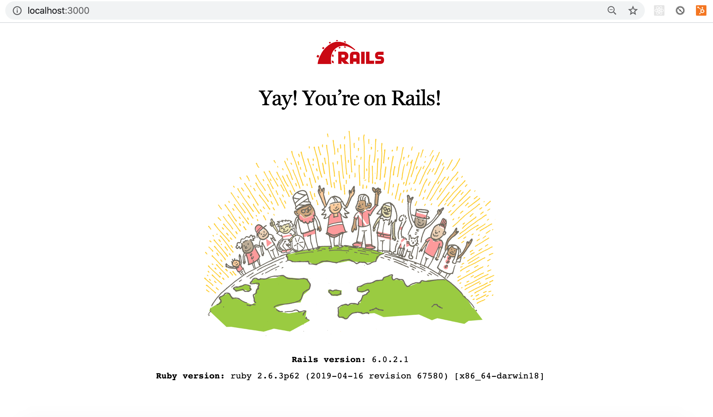

# Ruby on Rails Introduction

#### Overview
"Learning to build a modern web application is daunting. Ruby on Rails makes it much easier and more fun. It includes everything you need to build fantastic applications, and you can learn it with the support of our large, friendly community." -- Rails Docs

Ruby on Rails is a server-side web application framework written in Ruby. Rails was created by Danish programmer David Heinemeier Hansson (known as DHH). Rails was released in July 2004 as open source code. Rails is a model–view–controller (MVC) framework, providing default structures for a database, a web service, and web pages.

#### Previous Lecture (50 min)
[](https://www.youtube.com/watch?v=32GuNd2rFEk)

#### Learning Objectives
- can recall the command to create a new Rails application
- can recall the command to start the application server
- can view the Rails boilerplate page in the browser
- can navigate a Rails application to find the model, controller, views, db, gemfiles
- can recall the parts of MVC architecture
- can give examples of the technologies making up the MVC architecture

#### Vocabulary
- Ruby on Rails
- MVC

#### Additional Resources
- [Rails Docs](https://rubyonrails.org/)
- [History of Ruby on Rails](https://medium.com/@instaacarma/the-history-of-ruby-on-rails-986ead4e0e0a)

---
## Ruby on Rails Principles
- Convention over Configuration: "One of the early productivity mottos of Rails went: “You’re not a beautiful and unique snowflake”. It postulated that by giving up vain individuality, you can leapfrog the toils of mundane decisions, and make faster progress in areas that really matter."
- Programmer Happiness: "There would be no Rails without Ruby, so it's only fitting that the first doctrinal pillar is lifted straight from the core motivation for creating Ruby. Ruby’s original heresy was indeed to place the happiness of the programmer on a pedestal."

## Create a Rails App
Now that we've explored HTML, CSS, JavaScript, and Ruby, we have the complete set of tools needed to start learning **Ruby on Rails**, the framework for writing full-stack web applications in the Ruby programming language.

### MVC
Ruby on Rails follows an MVC architectural pattern. Architectural patterns are a way of dividing up responsibility within the application. **MVC** stands for model, view, and controller. Model is the database layer. The view is the part the user sees. The controller is like the switch board that collects appropriate data from the model and sends it to construct the view.

```
$ rails new app_name -d postgresql -T
$ cd app_name
$ rails db:create
$ rails server
```

- `rails new app_name`: generates a new folder with the entire Rails directory structure with all the code you need to run our simple application right out of the box
- `rails new app_app -d postgresql -T`: Rails comes with a default SQL database called SQLite, passing the flags `-d postgresql -T` will replace the default database with postgres
-  The `-T` flag tells rails to skip adding the default Minitest framework, as we're going to use Rspec instead
- `rails db:create`: sets up an empty database
- `rails server` or `rails s`: starts the Rails application by starting the server

In a browser navigate to:
`http://localhost:3000`
or
`127.0.0.1:3000`



---

# Lecture Notes

### Overview
- This lecture is informational

### Process
- Ensure you are in the cohort-lecture-examples repo
- Ensure your local is up to date and there are no stale branches
- Create a new branch
- Create a markdown file with the naming convention `rails-intro.md` for notes

### Additional Notes and Goals
- First glance at a Rails app

### Major Takeaways
- MVC architecture pattern
- Ruby on Rails history
- Command for creating a Rails app

### Lecture
Ruby on Rails is a framework written in the language Ruby. A framework dictates a flow of control. Meaning the framework defines the path for a developer to go about creating an application. So Rails is not a language. It is a framework that uses Ruby.

#### MVC
Ruby on Rails follows an MVC architectural pattern. Which basically means it is a way of organizing the responsibility of different aspects of your code. MVC stands for model, view, and controller.

So far we have only been dealing with the view. HTML, CSS, JavaScript, React are all part of the view. Model is the database layer. We are going to create just enough of a Rails app to be able to dig into the Model and get familiar with what is happening in the database and how Rails interacts with Postgres. Controllers are like a switch board, they dictate what the data should be collected from the model and then they send info back to construct the view.

When you put these three pieces together, the M, the V, and the C, you have a full-stack application. Rails is a MVC framework. But full-stack apps can be created from a variety of technologies.

#### Creating a Rails App
Rails has a database language and a testing framework by default. Rails comes with a database called SQLite database and a testing framework called MiniTest. Which is fine, but we want to use some different tools - specifically Postgres and RSpec. So to modify this we pass a couple of flags to the rails new command to alter the original build.

First let's check our rails version.
```
$ rails -v
```

Rails version numbers are in the form Major.Minor.Patch

```
$ rails new my_app -d postgresql -T
``

The app name must be lower case. Then we are passing the flag -d that is deleting the database and in its place installing Postgres. Then the -T flag deletes the MiniTest framework so that we can eventually use RSpec. This is the command to set up a new Rails app. You are going to be using this command a lot. It is the equivalent to the "yarn create react-app" command.

#### Rails
Ruby on Rails was created by a Danish computer scientist named David Heinemeier Hansson. He is known in the community as DHH. He first created Rails in 2004 and introduced it the annual Ruby conference in 2005. In 2006, Ruby on Rails was included on Apple's latest iOS release. Rails has been around quite a while and runs innately on Macs. Just like Ruby, Rails is open-source.

Rails is a server-side web application framework. It provides default code for a database, for web pages, for HTML and CSS, and actually has a little JavaScript in there as well.

When Rails came out it was really revolutionary and has influenced a lot of other backend frameworks. When DHH announced Rails at Ruby Conf in 2005, his famous quote was "Look at all the things I'm not doing." Which is to say that there is a lot of functionality that comes with Rails. The idea was to be able to get an application setup quickly and easily. So to make that happen, the Rails framework uses a concept called "Convention over Configuration." Basically, the idea was to decreases the number of design decisions made by the developer. That means to have a convention around how the file structured and the way the database is designed. So in that sense, Rails is very picky. We have to follow naming conventions very strictly. You will all struggle with this, we all do. The tradeoff is, if you follow the rules that Rails lays out, it will do a lot of the heavy lifting for you. This opens up the developer to solving more interesting problems. Which is really great, especially for junior developers. This idea of using naming conventions and predesigned file structures to do the heavy lifting is often referred to as "Rails magic".

Although it can be hard to get used to the Rails naming conventions and some of the way that Rails handles the logic, Rails does a really good job of defining MVC architecture. And the goal for us is to give you the basic understanding of backend development so that if you use Rails in your future, great, and if not, you have the fundamentals of this pattern so you can go off and learn whatever other technology that you want to learn.

#### Create db

```
$ cd my_app
$ rails db:create
```

When you create the database it is created on your local machine.
- To see this in the terminal type $ psql
- `\l ` lists all the databases which will include the new app

#### Files
- app/controllers
- app/models
- app/views
- config/routes
- db
- Gemfile
- README

```
$ rails server
$ rails s
```

The page does not automatically load. Unlike React, we have to go to the browser and navigate to localhost:3000.

### Review
- What is a framework?
- What does MVC stand for?
- What is the model?
- What is the Rails motto?
- What is the command to create a new Rails app?

### Next Steps
- Open the syllabus section and briefly run through the challenges and expectations
- Remind the student to use the `ruby-challenges` repo
- Remind the students of the appropriate naming conventions for their branch and file
- Post pairs in Slack
- Open breakout rooms with ability for participants to choose their room

---
[Back to Syllabus](../README.md#unit-five-intro-to-postgres-and-ruby-on-rails-models)
