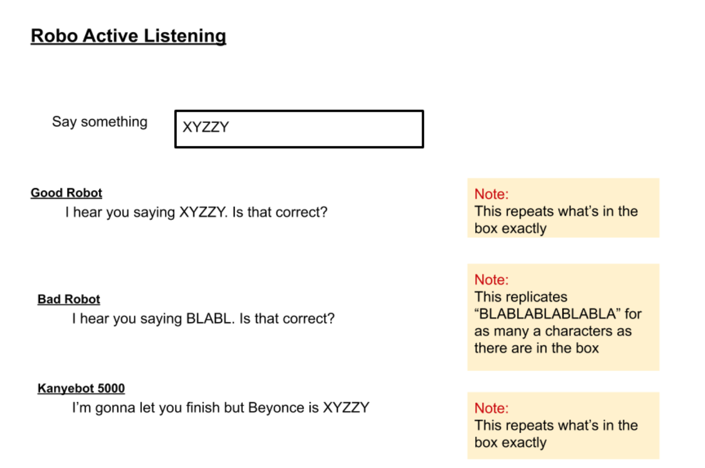

# React Inputs and Events

- [Challenges](#challenges)
- [Lecture Notes](#lecture-notes)

## Overview
- Adding a input fields to a React application
- Implementing listening events in React
- Updating state with every change to the DOM

## Learning Objectives
- Creating text input fields
- Exploring event listeners in JavaScript
- Creating a method to handle DOM event changes (what the user types)
- Creating a method to set state with the user input

## Vocabulary
- DOM event, often shortened to `e`
- Event listeners
- onChange
- HTML input tags
- Input attributes
- Handler methods

## Additional Resources
- [GeeksforGeeks](https://www.geeksforgeeks.org/javascript-events/)
- [W3Schools HTML Input](https://www.w3schools.com/tags/tag_input.asp)

#### Process
- `cd` into the `react-challenges` repository
- Create a new branch: `inputs-initials1-initials2` (ex. inputs-aw-sp)
- Create a new React application with no spaces: `yarn create react-app inputs-student1-student2` (ex. yarn create react-app inputs-austin-sarah)
- `cd` into the project
- Open the project in a text editor
- Create a directory in *src* called *components*
- Code!

#### Useful Commands
- $ yarn create react-app app-name
- $ yarn start
- control + c (stops the server)
- control + t (opens a new terminal tab)

#### Troubleshooting Tips
- Is your server running?
- Are your components imported and exported?
- What is your error message telling you?

---

## Inputs and DOM Events
Web applications are built to handle interaction with a user. These interactions can happen in a variety of ways. The user can click with their mouse, hover over elements, or use their keyboard to type. All of these interactions are considered **DOM events**. The DOM (Document Object Model) is always listening for changes. As a user moves their mouse across the screen, the DOM reacts by changing the view to represent the cursor's position. As developers, we want our web applications to recognize these interactions and respond accordingly depending on the type of event.

As developers, we can add event listeners to HTML (and JSX) tags that will wait for specific events to occur. One example is adding an `onClick` attribute to a button. The DOM is listening for a click event on that particular node and will execute the action described by the developer.

Another event listener is **onChange** which listens for any changes made to a particular node and executes a corresponding action. This type of listener is very handy when the user is typing in a text field. We can listen for the changes and capture the value of what the user is typing.

## Input Attributes
Inputs are HTML (and JSX) tags. Inputs are self closing, as they don't require inner HTML.

```javascript
<input />
```

**Type**  
Input tags provide lots of options for developers. Inputs can accept text, numbers, dates, passwords, and more. They can also look like text fields, radio buttons, or check boxes. This is determined by the "type" attribute.

```javascript
<input type="text" />
```

**Value**  
Value can be used differently for different types of input types. For buttons, a value attribute can represent the text that appears on the button. For text inputs, the value attribute can establish a default value. In React, the value attribute can directly represent the state object. Value works in conjunction with `onChange` to update state and store the user's input.

```javascript
<input
  type="text"
  value={this.state.userInput}
/>
```

**onChange**  
All inputs are listening for events. Developers can use the `onChange` method to execute logic every time there is a change on an element. In React, the onChange attribute can call a function that will update the state object and reflect back in the current value. It is customary to have an onChange listener associate with a **handler method**. Handler methods are named to associate their action with a particular event. By convention, a developer would know that a method called `handleChange` would be associated with an `onChange` event and a method called `handleClick` would be associated with an `onClick` event.

```javascript
<input
  type="text"
  value={this.state.userInput}
  onChange={this.handleChange}
/>
```

## Handle Change
In JavaScript, event listeners create a new instance of the class Event. Event has built in properties and methods that can be passed to a `handleChange` method. The convention is to shorten the name `event` to `e`.

```javascript
handleChange = (e) => {
  console.log(e)
}
```

By logging `e` we can look at the many properties and methods that are available to the class Event. To capture the characters the user is typing, we can use the property `target` which, as the name suggests, targets the input field.

```javascript
handleChange = (e) => {
  console.log(e.target)
}
```

Now that we have targeted the input, we can extract the value from the input field and set it to state.

**src/App.js**
```javascript
class App extends Component{
  constructor(props){
    super(props)
    this.state = {
      userInput: ""
    }
  }

  handleChange = (e) => {
    console.log(e.target.value)
    this.setState({userInput: e.target.value})
  }

  render(){
    return(
      <>
        <input
          type="text"
          value={this.state.userInput}
          onChange={this.handleChange}
        />
        <p>{this.state.userInput}</p>
      </>
    )
  }
}
export default App
```

## Summary
- Inputs are HTML (or JSX) tags that accept many attributes.
- Input attributes can modify the type of input, define the value, and listen for onChange events.
- onChange events call handler methods that execute JavaScript code.
- Event listeners create a new instance of the JavaScript class Event which has built in properties and methods.

## Challenges

- Listening Robot: As a user, I can see a page with a text input.
  - As a developer, I have one parent component that holds state (logic or smart component).
  - As a developer, I have an input in my parent component.
- As a user, I see titles of three robots waiting for my text.
  - As a developer, I have three child components that do not hold state (display or dumb component).
- As a user, when I enter text I see the three robots responses update in real time.
  - As a developer, I can call an onChange method on the input tag.
  - As a developer, I can pass the updated state as props to the child components.
  - As a developer, I can see the child components display the user input.
- As a user, I see my "Good Robot" repeating exactly what I type.
- As a user, I see my "Bad Robot" saying *BLABLA...*. One character for every character I type.
  - As a developer, I can create modification to the user input text by creating a method in my child component.
- As a user, I see a third robot that is the developer's choice.

---

# Lecture Notes

### Overview
- The DOM tracks interactions with the user
- These interactions can be captured and used inside the code logic of the application through JavaScript event listeners

### Process
- Ensure you are in the cohort-lecture-examples repo
- Ensure your local is up to date and there are no stale branches
- Create a new branch
- Create a React app with the naming convention `framework-topic`
- `cd` into the project
- Run the project with `yarn start`
- Ensure all git commands are done at the repo level and all yarn commands are done at the project level

### Additional Notes and Goals
- Revisit the fundamentals of React as you build

### Major Takeaways
- Inputs are HTML/JSX tags that can take attributes such as type and onChange
- Event listeners are a set of properties and methods in JavaScript that can be referenced by a developer
- Input values can be captured by a developer and set to state

### Lecture
React is really, really good at responding (or React-ing) to user interactions. React is able to handle user interactions effectively and efficiently by only making updating where there are changes detected rather than refreshing the entire page. React does this by always listening for any changes made to the DOM.
- DOM stands for Document Object Model
- React uses a Virtual DOM which is a representation of the actual DOM which will create a diff every time there is a change

#### Events
The browser is always listening for events. An event occurs anytime a user or the browser manipulates a webpage. Examples of events are when a page loads, when the user clicks a button, any key strokes, and resizing a window. All these events can be captured by developers through event handlers, or methods that track events. If you have ever used an onclick/onClick method you have made an event handler. While onclick is often used for button click events, we are going to talk about onChange which is used to capture text in an input field. Inputs are an HMTL/JSX tag
- Spin up a React App, convert App.js to a class component
- Add a heading an ensure the app is rendering
- Google "JavaScript inputs", select "HTML Input Types - W3Schools"
- Input is a self-closing tag, in HTML it can look like this `<input>` but in JSX it needs to look like this <input />
- By default the "type" is text but it is a good practice to specify the input type no matter what
- Play around with a few different types from the W3School docs: password will block characters, checkbox, submit will create a button, etc

```javascript
import React, { Component } from 'react'

class App extends Component {
  render() {
    return(
      <>
        <h1>Greeter App</h1>
        <input type="text"/>
        <input type="password"/>
        <input type="checkbox"/>
        <input type="submit"/>
      </>
    )
  }
}
export default App
```

#### OnChange
`onChange` is an attribute that lives on the input tag. Its job is to listen for changes in the input field and capture those changes. This action is a behavior so `onChange` is going to correspond to a method.
- It is convention for the method attached to the `onChange` attributes to be called `handleChange`
- `onChange` automatically passes an argument of event to the method
- It is common practice for event to be shortened to `e`
- Inspect the page and look at the logs for event
- Event is an object that has many key:value pairs
- One of the keys is called `target` which is also an object
- Inside the target there is a key called value that will have a string of the text from the input field
- Update the log to `e.target`
- Update the log to `e.target.value`

```javascript
import React, { Component } from 'react'

class App extends Component {

  handleChange = (e) => {
    console.log(e) // first step
    console.log(e.target) // second step
    console.log(e.target.value) // third step
  }

  render() {
    return(
      <>
        <h1>Greeter App</h1>
        <input type="text" onChange={this.handleChange} />
      </>
    )
  }
}
export default App
```

#### Setting State
Now that we are capturing the values from the input we can set them to state.
- Create a state object.
- Remove console.log and replace with `this.setState()`
- Adding a value attribute to connect the state object with what is showing up in the input field
- With several attributes it is best practice to drop the attributes onto additional lines

```javascript
import React, { Component } from 'react'

class App extends Component {
  constructor(props) {
    super(props)
    this.state = {
      name: ""
    }
  }

  handleChange = (e) => {
    this.setState({name: e.target.value})
  }

  render() {
    console.log(this.state.name)
    return(
      <>
        <h1>Greeter App</h1>
        // first step: show a hardcoded value
        <input
          type="text"
          onChange={this.handleChange}
          value="hello"
        />
        // second step: change the value to reflect the current value of state
        <input
          type="text"
          onChange={this.handleChange}
          value={this.state.name}
        />
      </>
    )
  }
}
export default App
```

#### Passing the Input as Props
Now that we have the value in state we can pass the data to another component.
- Create a folder called `components`
- Create a file called `Yelling.js`
- Create a class component with a heading
- Import the component to App.js
- Call the component and see the heading render
- Pass the state value into the Yelling component
- Call the value as props

```javascript
// src/App.js
import React, { Component } from 'react'
import Yelling from './components/Yelling'

class App extends Component {
  constructor(props) {
    super(props)
    this.state = {
      name: ""
    }
  }

  handleChange = (e) => {
    this.setState({name: e.target.value})
  }

  render() {
    return(
      <>
        <h1>Greeter App</h1>
        <input
          type="text"
          onChange={this.handleChange}
          value={this.state.value}
        />
        <Yelling name={this.state.name}/>
      </>
    )
  }
}
export default App

// src/components/Yelling.js

import React, { Component } from 'react'

class Yelling extends Component {
  render() {
    return(
      <>
        <h3>HELLO, I SEE YOUR NAME IS:</h3>
        <p>{this.props.name}</p>
      </>
    )
  }
}
export default Yelling
```

#### Manipulating the Prop Values
Inside the Yelling component we can use JavaScript logic to manipulate the output. We don't need state, just a good ol' fashion class method.
- Create a method with a parameter
- Return the parameter in all uppercase letters
- Call the method and pass in the argument of the props values
```javascript
// src/components/Yelling.js

import React, { Component } from 'react'

class Yelling extends Component {
  yelling = (userInput) => {
    return userInput.toUpperCase()
  }

  render() {
    return(
      <>
        <h3>HELLO, I SEE YOUR NAME IS:</h3>
        <p>{this.yelling(this.props.name)}</p>
      </>
    )
  }
}
export default Yelling
```
### Review
- What is an input?
- What different types of inputs are there?
- What is an event?
- What is the convention for naming the event?
- What data type is the event?
- What does the onChange attribute do?

### Next Steps
- Open the syllabus section and briefly run through the challenges and expectations
- Remind the student to use the `react-challenges` repo
- Remind the students of the appropriate naming conventions for their branch and project name
- Remind the students that yarn commands happen at the project level and git commands happen at the repo level
- Post pairs in Slack
- Open breakout rooms with ability for participants to choose their room
---
[Back to Syllabus](../README.md#unit-two-introduction-to-react)
